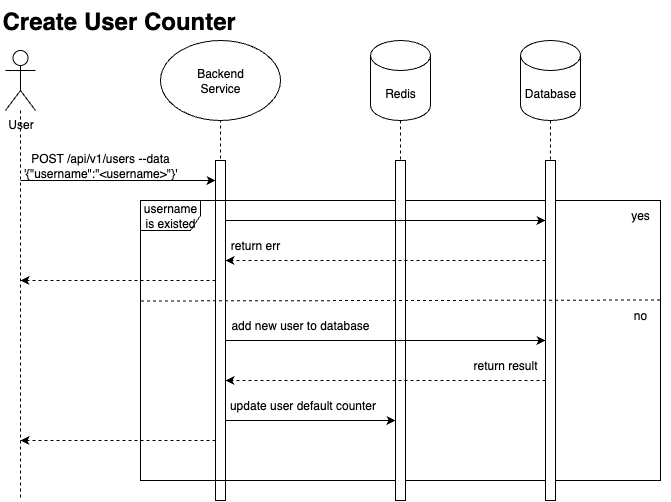
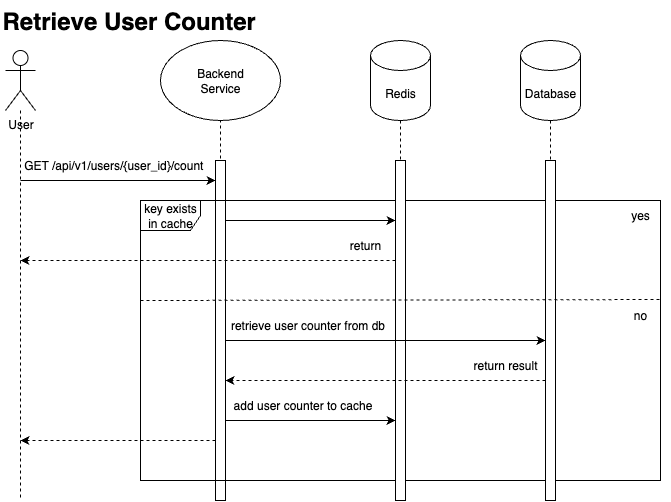
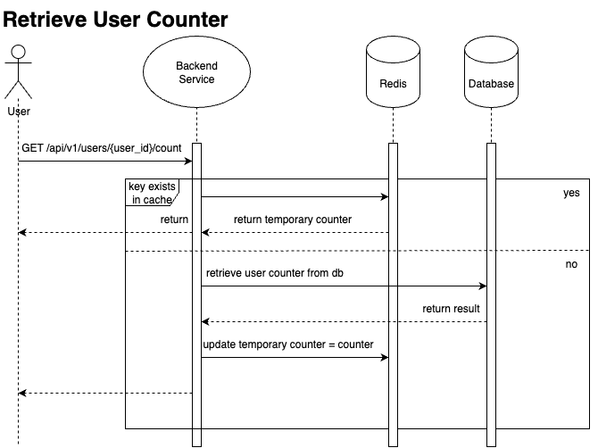
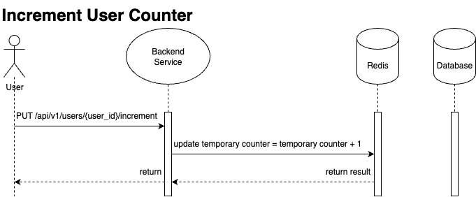
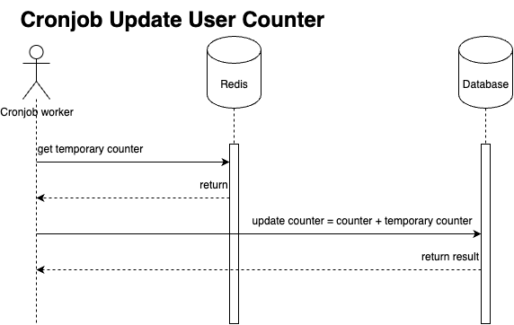

# User Counter - Onboarding Project
**Name:** UserCounter

**Description:** A simple RESTful service that tracks and increments a counter for registered users, storing persistent data in MySQL and caching transient data in Redis. The service will use a Kubernetes operator to manage its lifecycle and goroutines to handle concurrent requests efficiently. You’ll deploy it to our K8s dev cluster using a Deployments (https://kubernetes.io/docs/concepts/workloads/controllers/deployment/) for stable identity and a Secrets (https://kubernetes.io/docs/concepts/configuration/secret/) for configuration and Ingress (https://kubernetes.io/docs/concepts/services-networking/ingress/) to manages external access to the services in a cluster.

## Technology Stack
### Backend
- **Language**: Golang
- **Framework**: Gin
- **Database**: MySQL
  - **Cache**: Redis
- **Deployment**: Docker, Kubernetes
- **Load Test**: K6

## Getting Started
### Prerequisites
- Go 1.25+
- MySQL 8.0+
- Redis 7.2.4+
- Kubernetes 1.33+
- K6 1.3.0+

### Installation
#### Install from Source

1. Clone the repository:
    ```bash
    git clone https://github.com/ntploc21/user-counter.git
    cd user-counter
    ```

2. Setup environment variables:
    ```bash
    cp .env.example .env
    # Edit .env with your configuration: MySQL database name, server ports, etc.
    ```

3. Install dependencies:
    ```bash
    go mod download
    ```

4. Run docker compose to start MySQL, Redis and your application:
    ```bash
    docker-compose up -d --build
    ```

5. Verify that the containers are running:
    ```bash
    docker-compose ps
    ```
    You will see 3 container name `onboard_mysql`, `onboard_redis`, and `onboard_backend`.

6. Access the application:
    ```bash
    http://localhost:8080
    ```

### Setup in Kubernetes
1. Clone repository:
    ```
    git clone https://github.com/ntploc21/user-counter.git
    ```
2. Build images:
    ```bash
    docker build -t <YOUR_NAME>/<REPOSIORY_NAME>:<YOUR_TAG> .
    ```
    Example
    ```bash
    docker build -t ntploc21/user-counter:v0.0.1 .
    ```

3. Deploy to Kubernetes:
    ```bash
    libectl apply -f k8s/dev/k8s.secret.yaml -f k8s/dev/k8s.configmap.yaml -f k8s/dev/k8s.datastore.yaml -f k8s/dev/k8s/service.yaml -f k8s/dev/k8s.application.yaml
    ```

4. Verify:
    ```bash
    kubectl get pod -n <namespace|locntp>
    ```

#### Kubernetes Deployment Diagram

TBU

### API Document

#### Create User
```http
   POST /api/v1/users
```
| Json fields | Type     | Description                       |
|:------------| :------- | :-------------------------------- |
| `username`  | `string` | **Required**. username of user |

#### Get counter of user

```http
    GET /api/v1/users/{user_id}/count
```
| Parameter | Type     | Description              |
|:----------| :------- |:-------------------------|
| `user_id` | `string` | **Required**. id of user |

#### Increase counter of user by one

```http
    PUT /api/v1/users/{user_id}/increment
```
| Parameter | Type     | Description              |
|:----------| :------- |:-------------------------|
| `user_id` | `string` | **Required**. id of user |

#### Delete user counter

```http
    DELETE /api/v1/users/{user_id}
```
| Parameter | Type     | Description              |
|:----------| :------- |:-------------------------|
| `user_id` | `string` | **Required**. id of user |

## Software Design
### System Design

TBU

### MySQL Database Design
Schema
```sql
CREATE TABLE users (
    id INT AUTO_INCREMENT PRIMARY KEY,
    username VARCHAR(100) NOT NULL UNIQUE,
    counter INT DEFAULT 0,
    created_at TIMESTAMP DEFAULT CURRENT_TIMESTAMP,
    updated_at TIMESTAMP DEFAULT CURRENT_TIMESTAMP ON UPDATE CURRENT_TIMESTAMP
);
```

### Project Structure
    .
    ├── cmd                         # Commands to run service
        └── main.go                 # Main entry point file for the application
    ├── config                      # Configuration files (environment variables, database, etc.)
    ├── internal                    # Internal source code implementation of core service
        ├── app                     # Application initialization (dependency injection, startup logic)
        ├── routes                  # Request routing and HTTP endpoint registration
        ├── models                  # GORM models for database queries
        ├── repositories            # Data access layer handling database operations
        ├── controllers             # Request handlers coordinating between routes and services
        └── services                # Business logic services
    ├── pkg                         # Reusable packages
    ├── k8s                         # Kubernetes manifests for deployment and service configuration
    ├── Makefile                    # Build, test, and run automation commands
    ├── assets                      # Documentation files referenced in README
    └── README.md                   # Project overview, setup guide, and documentation

### Sequence Diagram

#### Create User Counter

#### Get User Counter

##### Solution 1: High consistency (I use this solution)


In this solution, the system ensure the counter of each user is right and consistent between cache (Redis) and database (MySQL). 

When a request to get the counter of a user is received, the system first checks if the counter is available in Redis. If it is found, the value is returned directly from Redis, ensuring fast access. If the counter is not found in Redis (cache miss), the system retrieves the counter from MySQL, updates the Redis cache with this value for future requests, and then returns the value to the client. This approach guarantees that the counter value is always accurate and consistent between Redis and MySQL.

**Advantage**: High consistency, the counter of each user is always correct and consistent between Redis and MySQL.

**Disadvantage**: Higher latency on cache miss, as it requires a database query to fetch the counter.

##### Solution 2: High Availability







In this solution, the system prioritizes availability and performance over strict consistency between Redis and MySQL.

When a request to get the counter of a user is received, the system first checks if the counter is available in Redis. If it is found, the value is returned directly from Redis, ensuring fast access. If the counter is not found in Redis (cache miss), the system retrieves the counter from MySQL, updates the Redis cache with this value for future requests, and then returns the value to the client.

When a request to increment the counter of a user is received, the system increments the counter directly in Redis without immediately updating MySQL. This allows for quick updates and reduces latency for increment operations.

To ensure that the data in MySQL remains reasonably up-to-date, a background job (cron job) runs at regular intervals to synchronize the counters from Redis back to MySQL. This job iterates through the cached counters in Redis and updates the corresponding records in MySQL.

**Advantage**: High availability and performance, as read and increment operations are fast due to Redis caching.

**Disadvantage**: Potential for temporary inconsistency between Redis and MySQL, as increments are not immediately reflected in the database. Additionally, if the cache is lost, some increments may be lost unless they have been synchronized to MySQL.

## Contributors

Nguyễn Thanh Phước Lộc, Associate Software Engineer
- [locntp@vng.com.vn](locntp@vng.com.vn) 